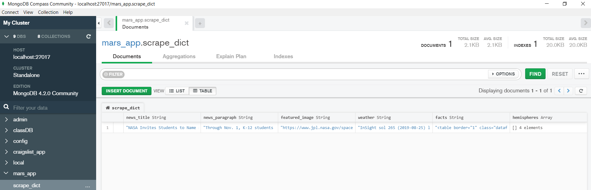
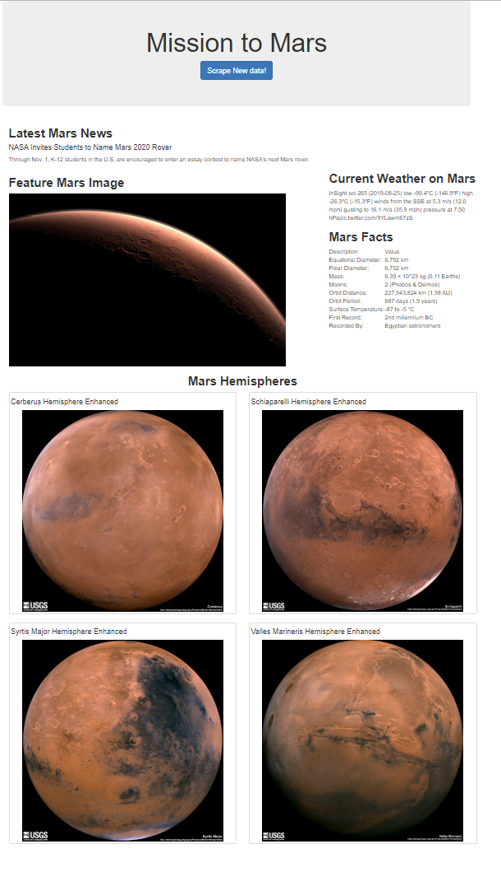

# HW12: web scrapping
## Mission to Mars

### Aims: 
- Web scrape to get information and images from Mars
- Visualize the scraped information using Mongo and flask

### Scraped web page: 
- [News](https://mars.nasa.gov/news/)
- [Mars image (top)](https://www.jpl.nasa.gov/spaceimages/?search=&category=Mars)
- [Weather](https://twitter.com/marswxreport?lang=en)
- [Fact table](https://space-facts.com/mars/)
- [Mars Hemisphere](https://astrogeology.usgs.gov/search/results?q=hemisphere+enhanced&k1=target&v1=Mars)


### Requirement:
- Web scrapping code uses pyMongo, splinter
- Internet connection

### How to run:
- In Terminal, type
```python
conda activate PythonData
python app.py
```
- or from Visual code, right-click on "open in Terminal" to activate PythonData, then type in terminal
```python
python app.py
```

### Data stored in Mongo


### Visualization

